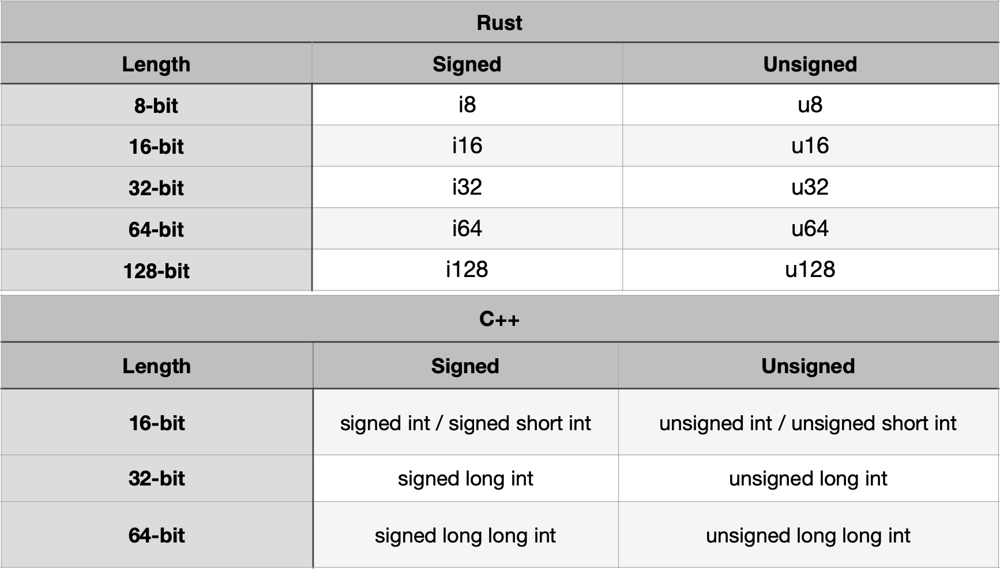
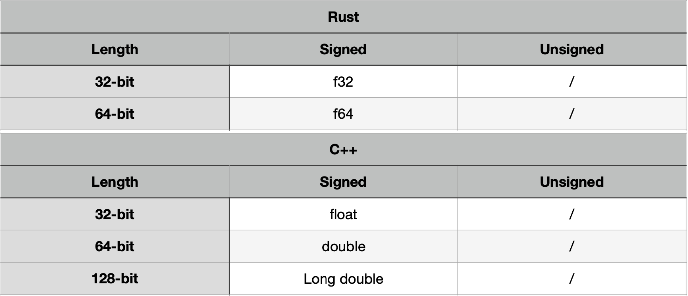
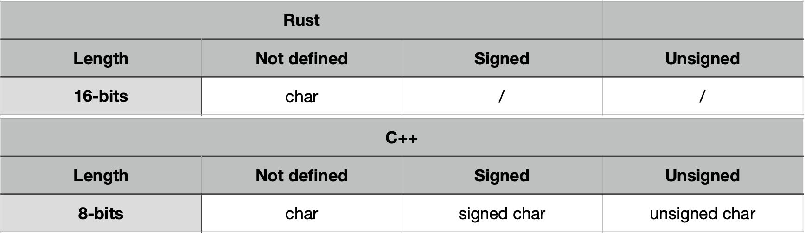

<h1 style="text-align: center">2022-2023-project-3-harfang3d-binding-Project-6-group</h1>

<details> 
<summary style="text-decoration: underline; font-size:150%">Table of contents:</summary>

- [1. Front matter](#1-front-matter)
- [2. Introduction](#2-introduction)
	- [a. Overview](#a-overview)
	- [b. Glossary](#b-glossary)
	- [c. Context or Background](#c-context-or-background)
	- [d. Client Requirements](#d-client-requirements)
	- [e. Project Requirements](#e-project-requirements)
	- [f. Future Goals](#f-future-goals)
	- [g. Assumptions](#g-assumptions)
- [3. Solutions](#3-solutions)
	- [a. Existing Solution](#a-existing-solution)
	- [b. Release / Roll-out and Deployment Plan](#b-release--roll-out-and-deployment-plan)
	- [c. Alternate Solutions](#c-alternate-solutions)
- [4. Program Development](#4-program-development)
	- [a. Type compatibility](#a-type-compatibility)
	- [b. Type converter](#b-type-converter)
	- [b. Function implementation](#b-function-implementation)
	- [c.](#c)
	- [d. Rust generator class](#d-rust-generator-class)
	- [Tests](#tests)
- [5. Further Considerations](#5-further-considerations)
	- [a. Contact with the client](#a-contact-with-the-client)
	- [b. Impact on the company](#b-impact-on-the-company)
- [6. Project Management](#6-project-management)
	- [a. Prioritization](#a-prioritization)
	- [b. Milestones](#b-milestones)
- [7. End Matter](#7-end-matter)
	- [a. References](#a-references)
	- [b. Acknowledgement](#b-acknowledgement)
</details>

--- 

# 1. Front matter

Client: [Harfang3D](https://www.harfang3d.com/)

| Role              | Name                                                                                                                                                                                                                                                          |
| ----------------- | ------------------------------------------------------------------------------------------------------------------------------------------------------------------------------------------------------------------------------------------------------------- |
| Project Manager   | [RIVIÈRE Guillaume](https://github.com/Guillaume-Riviere)                                                                                                                                    |
| Program Manager   | [LAVATINE Lucien](https://github.com/LucienLAVATINE)                                                                                                                                                                                           |
| Technical Leader  | [CLÉMENT Quentin](https://github.com/Quentin-Clement)                                                                                                                                                                                           |
| Software Engineer | [LEMOINE Arthur](https://github.com/arthur-lemo1ne)                                                                                                                                                                                     |
| Q&A               | [CATON CLÉMENT](https://github.com/ClementCaton) |

Author: Quentin CLEMENT 
<br>
Created on: 01/03/2023

# 2. Introduction

## a. Overview

Fabgen is a set of Python scripts to generate C++ binding code to different languages. It was developed by **Harfang3D**.
It was written as a SWIG replacement for the Harfang Multimedia Framework.

Currently, you can generate bindings for the following languages:
- Python
- Lua
- GO

They now want to implement 2 new languages, Rust and F#.

Our team will work on the Rust implementation.

## b. Glossary

| Terms                        | Definition             |
| ---------------------------- | ---------------------------------------------------------------------------------------------------------------------------------------------------------------------------------|
| Binding| Data binding, the technique of connecting two data elements together.|
| SWIG| SWIG is a software development tool that connects programs written in C and C++ with a variety of high-level programming languages.|
| Software| The term software is used to describe software that enables your computer to operate and handles data processing. Several software are installed on your device to give commands, so that specific tasks are performed according to their uses.|
| C, C++, Python, Lua, GO, Rust, F#| Programming languages|
| AI| The theory and development of computer systems able to perform tasks normally requiring human intelligence, such as visual perception, speech recognition, decision-making, and translation between languages.|
| Type| A type is a classification identifying one of various types of data, such as char, integer, or Boolean, that determines the possible values for that type and the set of operations that can be performed on values of that type.|
| Char| a data type that holds one character (letter, number, etc.) of data.|
| Int| a datum of integral data type, a data type that represents some range of mathematical integers.|
| Float| a float is a data type composed of a number that is not an integer, because it includes a fraction represented in decimal format.|
| Bool| a data type that has one of two possible values (usually denoted true and false) which is intended to represent the two truth values of logic and Boolean algebra.|
| String| a string is traditionally a sequence of characters, either as a literal constant or as some kind of variable.|


## c. Context or Background

At the moment, Fabgen can generate binding for only 3 languages. But there are so many languages used, that it would be useful to add more to the list.

## d. Client Requirements

The Rust implementation in Fabgen need to be similar to previous languages already implemented. In particular GO which is the most similar language to Rust. The same features will be brought. Ideas for improvement will be welcome to improve the previous languages such as GO where there are still some problems with the bindings.

## e. Project Requirements

- The software engineer must know C++ and Rust and its feature set. A deep understanding of those features and inner workings is required to come up with a correct solution.

## f. Future Goals

Fabgen will be able to generate bindings for more languages.

## g. Assumptions

Make a perfect translation of the code from one language to another without the need of the rechecking/correction of the code by a human-being.
  
# 3. Solutions
## a. Existing Solution

SWIG: an open source software tool, allowing to connect software or software libraries written in C/C++ with scripting languages such as: Tcl, Perl, Python, Ruby, PHP, Lua or other programming languages like Java, C#, Scheme and OCaml. <br>
Facebook’s TransCoder AI:  Trained AI capable to understand the code in a different language and able to convert the code from one language to another.

## b. Release / Roll-out and Deployment Plan

At the end of the 6 weeks, **Harfang3D** will check if the software is perfectly working. They will also look at the code to confirm everything correspond to what they wanted. If they are satisfied, they will deploy a new version of Fabgen with the new languages implemented in it. After that, the users will be able to use the new features of Fabgen in their projects.

## c. Alternate Solutions 

Instead of using bindings, it could be another solution to use an AI. Instead of translating the whole code, the AI would be able to understand the logic of the code and the willingness of the user. It could also allow to improve some parts of the code when the writing is not optimal and better things could be brought to achieve the same goal. However, this solution is more complicated to set up because it would be too long to develop and it would be too expensive.

# 4. Program Development

add an argument to the generator

## a. Type compatibility

**Integers:** <br>



**Floats:** <br>



**Chars:** <br>



The boolean type is the same in Rust and in C++. <br>

The string type exists in Rust but not in C++ so we will use tables of chars instead. <br>

## b. Type converter

Each type converter (except the vector converter) class need to contain these 4 methods. This is the model of the methods but they must be adapted in each case (the content, the order, add other methods, etc...).

```py
def get_type_glue(self, gen, module_name):
	return ""

def get_type_api(self, module_name):
	return ""

def to_c_call(self, in_var, out_var_p, is_pointer):
	return ""

def from_c_call(self, out_var, expr, ownership):
	return ""
```

**Rust type converter:** <br>

The Rust type converter will be use to convert Rust types to C++ types. It will initialize the TypeConverter function in gen.py. It will initialize the base_type as type, rust_to_c_type as none and rust_type as none. This converter need to be created in the file [rust.py](../lang/rust.py).<br>

```py
class RustTypeConverterCommon(gen.TypeConverter):
	def __init__(self, type, to_c_storage_type=None, bound_name=None, from_c_storage_type=None, needs_c_storage_class=False):
		super().__init__(type, to_c_storage_type, bound_name, from_c_storage_type, needs_c_storage_class)
		self.base_type = type
		self.rust_to_c_type = None
		self.rust_type = None
```

**Bool type converter:** <br>

As we said before, the Boolean type is the same in Rust and C++, so it's juste a conversion between the 2.

```py
class RustBoolConverter(lang.rust.RustTypeConverterCommon):
		def __init__(self, type, to_c_storage_type=None, bound_name=None, from_c_storage_type=None, needs_c_storage_class=False):
			super().__init__(type, to_c_storage_type, bound_name, from_c_storage_type, needs_c_storage_class)
			self.rust_to_c_type = "C.bool"
```

**Character converter** <br>

The char type is similar in Rust and C++ so the conversion doesn't need to be complicated.

```py
class RustConstCharPtrConverter(lang.rust.RustTypeConverterCommon):
		def __init__(self, type, to_c_storage_type=None, bound_name=None, from_c_storage_type=None, needs_c_storage_class=False):
			super().__init__(type, to_c_storage_type, bound_name, from_c_storage_type, needs_c_storage_class)
			self.rust_to_c_type = "*C.char"
			self.rust_type = "string"

		def to_c_call(self, in_var, out_var_p, is_pointer=False):
			if is_pointer:
				out = f"{out_var_p.replace('&', '_')}1 := C.CString(*{in_var})\n"
				out += f"{out_var_p.replace('&', '_')} := &{out_var_p.replace('&', '_')}1\n"
			else:
				out = f"{out_var_p.replace('&', '_')}, idFin{out_var_p.replace('&', '_')} := wrapString({in_var})\n"
				out += f"defer idFin{out_var_p.replace('&', '_')}()\n"
			return out

		def from_c_call(self, out_var, expr, ownership):
			return "C.RustString(%s)" % (out_var)
```

Then you will bind the 2 types by initializing type with "const char *".

**Basic type converter:** <br>

A basic type converter must be created. It will take as parameters the type of the object (when it's an int or a float), its equivalent in C++ and its equivalent in Rust. Then you will use this function to associate each type with its equivalent in C++ and Rust. <br>

```py
class RustBasicTypeConverter(lang.rust.RustTypeConverterCommon):
	def __init__(self, type, c_type, rust_type, to_c_storage_type=None, bound_name=None, from_c_storage_type=None, needs_c_storage_class=False):
		super().__init__(type, to_c_storage_type, bound_name, from_c_storage_type, needs_c_storage_class)
		self.rust_to_c_type = c_type
		self.rust_type = rust_type
```

**String converter**

As we said before, the string type doesn't exist in C++. But with the namespace std, it will automatically convert char tables in string in C++. So the conversion is the same as the charachter one but when you will bind the types using the function, you will initialize type as "std::string".

```py
class RustStringConverter(lang.rust.RustTypeConverterCommon):
		def __init__(self, type, to_c_storage_type=None, bound_name=None, from_c_storage_type=None, needs_c_storage_class=False):
			super().__init__(type, to_c_storage_type, bound_name, from_c_storage_type, needs_c_storage_class)
			self.rust_to_c_type = "*C.char"
			self.rust_type = "string"
```

The to_c_call and from_c_call methods are exactly the same as for the char converter.

**Vector converter**

The vector type is the same in Rust and in C++ so we just need to associate the 2 types with the function T_conv.

```py
class RustVectorToStdVectorConverter(lang.rust.RustTypeConverterCommon):
	def __init__(self, type, T_conv):
		native_type = f"std::vector<{T_conv.ctype}>"
		super().__init__(type, native_type, None, native_type)
		self.T_conv = T_conv
```

## b. Function implementation

**Route lambda**

This function declares a function in C from . <br>
We can keep the existing function in rust.py.

**Clean name**

This function is used to clean the name of the function. Indeed, some names are reserved in Rust so we need to add "Rust" at the end of the name to make it usable. <br>

Reserved keywords in Rust: as, break, const, continue, crate, else, enum, extern, false, fn, for, if, impl, in, let, loop, match, mod, move, mut, pub, ref,return,self, Self, static, struct, super, trait, true, type, unsafe, use, where, while, async, await, dyn. <br>

We can keep the existing function in go.py but we need to change the Go reserved list by the ones above and replace "Go" by "Rust" at the end of "new_name".

**Clean name with title**

This function is used to transform the name of the function in Pascal case. <br>
We can keep the existing function in rust.py.

## c. 

```py
class RustClassTypeDefaultConverter(RustTypeConverterCommon):
```

```py
class RustExternTypeConverter(RustTypeConverterCommon):
```

## d. Rust generator class

List of functions to implement in this class:
- __ init __(self, type, to_c_storage_type=None, bound_name=None, from_c_storage_type=None, needs_c_storage_class=False):
		super().__init__(type, to_c_storage_type, bound_name, from_c_storage_type, needs_c_storage_class)
- get_language(self)
- output_includes(self)
- start(self, module_name)
- set_compilation_directives(self, directives)
- get_binding_api_declaration(self)
- output_binding_api(self)
- get_output(self)
- _get_type(self, name)
- _get_conv(self, conv_name)
- _get_conv_from_bound_name(self, bound_name)
- __get_is_type_class_or_pointer_with_class(self, conv)
- __get_stars(self, val, start_stars=0, add_start_for_ref=True)
- __arg_from_cpp_to_c(self, val, retval_name, just_copy)
- __arg_from_c_to_cpp(self, val, retval_name, add_star=True)
- __arg_from_c_to_rust(self, val, retval_name, non_owning=False)
- __arg_from_rust_to_c(self, val, arg_name)
- __get_arg_bound_name_to_rust(self, val)
- __get_arg_bound_name_to_c(self, val)
- __extract_sequence_rust(self, conv)
- __extract_sequence(self, conv, is_in_header=False)
- __extract_get_set_member_rust(self, classname, member, static=False, name=None, bound_name=None, is_global=False, implicit_cast=None)
- create_get_set(do_static)
- __extract_get_set_member(self, classname, convClass, member, static=False, name=None, bound_name=None, is_global=False, is_in_header=False)
- __extract_method_rust(self, classname, convClass, method, static=False, name=None, bound_name=None, is_global=False, is_constructor=False)
- __extract_method(self, classname, convClass, method, static=False, name=None, bound_name=None, is_global=False, is_in_header=False, is_constructor=False, overload_op=None)
- _check_arg_out_add_constructor_if_needed(self, method)
- finalize(self)
- bind_method_translate(classname, convClass, method, static=False, name=None, bound_name=None, is_global=False, is_constructor=False)

They are already implemented in the go.py file but it is better to start from scratch than to modify the existing code.

## Tests

Tests will be run with docker by the Q&A.

# 5. Further Considerations

## a. Contact with the client

The developers of Harfang3D are the one who created Fabgen and implemented the first 3 languages. If we have questions or problems, we can contact them by email. They want to know the progress of the project every week. We can use these emails to ask for help. We can also ask them if we have an idea about something out of the requirements.

## b. Impact on the company

Fabgen is an important project for **Harfang3D** because it's the development of a software which is out of their principal scope of action. By improving their library, they will attract more users so more visibility and get into a new possible market. Afterwards, it will help them to get more clients and to develop their business.

# 6. Project Management
## a. Prioritization

https://github.com/orgs/algosup/projects/6

## b. Milestones

- **1st week:**
Run existing test and finish documents
- **2nd week:**
Work faster
- **3rd week:**
Finish tech spec, finish comments
- **4rd week:**
- **5th week:**
- **6th week:**

# 7. End Matter

## a. References

Harfang3D: https://www.harfang3d.com/ <br>
Harfang3D Github: https://github.com/harfang3d <br>
Harfang3D Github repository: https://github.com/harfang3d/harfang3d <br>
Harfang3D ALGOSUP Github repository: https://github.com/harfang3d/algosup-binding-project <br>

## b. Acknowledgement

[Harfang3D](https://www.harfang3d.com/): The client of this project. <br>
[Emmanuel JULIEN](https://www.linkedin.com/in/ejulien/): Harfang3D Lead developer who presented us the project. <br>
[François GUTHERZ](https://www.linkedin.com/in/astrofra/): Harfang3D CTO & Project leader who presented us the project. <br>
[Laurent Wouters](https://www.linkedin.com/in/laurent-wouters-7439aa59/): CEO at Cénotélie/Rust trainer